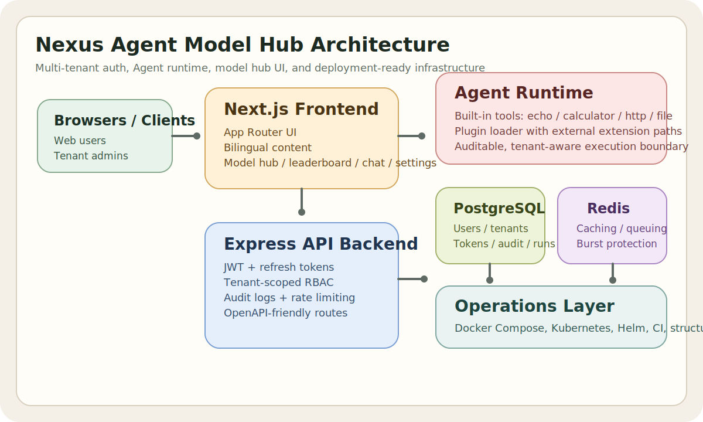

# Nexus Agent Model Hub 文档总览

Nexus Agent Model Hub 是一套面向多租户登录、Agent 工具调用、模型目录、排行榜与会话工作区场景的源码开放产品基线仓库，提供双语界面、双语文档、Docker 部署资产与可扩展插件能力。

[English](../en/README.md) | **中文**

## 关于项目

Nexus Agent Model Hub 适合希望同时获得严格租户隔离、可复用登录系统、内置 Agent 工具调用、双语文档以及可部署基础设施的团队与开发者。

## 快速预览

仓库首页用的界面预览示意图。


## 架构总览

覆盖前端、后端、Agent 运行时、数据存储与运维层的高层架构示意图。



## 1. 项目目标与约束

- 交付一个可直接 fork 的仓库骨架，而不是只给概念设计。
- 在数据模型、API、审计日志三层落实租户隔离。
- 支持多用户并发登录、刷新令牌、可选 TOTP 双因子。
- 内置可扩展 Agent 工具调用能力，并允许插件式接入。
- 把原有“大模型百科 / 排行榜 / 会话工作区 / 设置页”融合进同一根目录项目。
- 同时交付中文与英文界面、中文与英文文档。
- 默认使用严格不可商用的源码开放许可，避免许可歧义。

最低验收阈值：

- 单节点开发部署下，认证类 CRUD API 的 P95 响应时间不高于 300ms
- Agent 调度开销 P95 不高于 100ms，不含外部工具执行耗时
- 通过既有 API 路径不得出现跨租户读写
- 所有环境都具备结构化日志和健康检查
- 常见笔记本在 5 分钟内可通过 Docker Compose 拉起最小环境

## 2. 仓库交付内容

- 严格按租户隔离的多租户登录系统
- JWT 访问令牌与刷新令牌认证流程
- 租户级 RBAC 与审计日志
- 支持插件注册的内置 Agent 工具调用能力
- 已集成模型百科、模型对比、排行榜、供应商设置与会话工作区页面
- 中文和英文界面，以及双语说明文档
- Docker Compose、Kubernetes 与 Helm 部署资产
- OpenAPI 草案、Prisma Schema、数据库迁移、CI 工作流与贡献指南

## 3. 方案 A 决策映射

本仓库遵循给定 Scheme A 基线的设计精神，并在 [SCHEME_A_DECISIONS.md](./SCHEME_A_DECISIONS.md) 中记录每一项决策。

关键选择：

- 数据库：本仓库文档中的本地、CI 与生产路径统一以 PostgreSQL 为基线
- 认证：提供完整用户认证流程，使用 JWT 与刷新令牌，并补充了 Next.js 客户端的 Auth.js v5 集成路径
- Agent 传输：接口契约对 SSE 友好，首个版本内置基础工具
- 部署：默认交付 Docker 自托管方案，同时保留 Vercel 风格前端托管的可选路径
- 国际化：首个 MVP 交付 `zh-CN` 与 `en-US`

## 4. 架构说明

见 [ARCHITECTURE.md](./ARCHITECTURE.md)。

## 产品就绪度

见 [PRODUCT_READYNESS.md](./PRODUCT_READYNESS.md)。

## 5. 仓库结构

见 [REPOSITORY_MAP.md](./REPOSITORY_MAP.md)。

## 6. 快速开始

```bash
# 可选：如需自定义密钥或端口，再复制模板
cp .env.example .env
docker compose up -d postgres redis
npm install
npm run db:generate
npm run db:migrate
npm run db:seed
npm run dev:backend
npm run dev:frontend
```

如果只想一条命令直接起完整容器栈，也可以：

```bash
cp .env.example .env
docker compose up --build
```

启动后可访问：

- Web 界面：`http://localhost:3000`
- API 健康检查：`http://localhost:4000/api/v1/health`
- 平台摘要接口：`http://localhost:4000/api/v1/platform/summary`
- OpenAPI 草案：[`../api/openapi.yaml`](../api/openapi.yaml)
- 社区治理文件：[CONTRIBUTING](../../CONTRIBUTING.md)、[CODE_OF_CONDUCT](../../CODE_OF_CONDUCT.md)、[SECURITY](../../SECURITY.md)、[CHANGELOG](../../CHANGELOG.md)

常用校验命令：

- `npm run typecheck`
- `npm run test`
- `npm run build`
- `./scripts/check.sh`
- `npm run leaderboard:refresh --workspace=packages/frontend`

模型内容说明：

- 如果 `content/models/*.mdx` 中存在与模型 slug 对应的内容文件，模型详情页现在会自动把这部分内容合并展示出来。
- 当前已经接入的示例内容包括 `gpt-4o`、`claude-sonnet-4`、`gemini-2-5-pro`，后续继续补充时无需改详情页结构。

默认预置初始账号：

- Tenant：`primary`
- Email：`owner@primary.local`
- Password：`ChangeMe123!`

## 7. 最小产品验收流程

1. 注册一个租户管理员，或使用预置初始账号登录。
2. 进入控制台，查看当前租户数据。
3. 浏览 `/models`、`/leaderboard`、`/compare`、`/chat` 与 `/settings` 页面。
4. 在控制台运维面板中调用内置 `echo` 或 `calculator` Agent。
5. 查看审计日志与 Agent 运行历史。

## 8. 部署说明

见 [DEPLOYMENT.md](./DEPLOYMENT.md)。

### 配置提示

- `CORS_ORIGIN` 支持逗号分隔多个来源，适合前后端分域、预发环境或多入口预览。
- `NEXT_PUBLIC_API_URL` 应指向外部可访问的后端地址，例如 `https://api.example.com/api/v1`。
- 当前前端为了便于快速部署，默认把浏览器会话放在本地存储；生产浏览器场景建议切换为 HttpOnly Cookie 或 BFF。
- `/settings` 页面现在会把本地联调用的供应商配置持久化到文件，但正式环境仍应使用密钥管理服务。

## 8.1 环境变量概览

- 服务标识：`APP_NAME`、`APP_VERSION`、`APP_PORT`、`FRONTEND_PORT`
- 数据服务：`DATABASE_URL`、`REDIS_URL`
- 鉴权：`JWT_SECRET`、`JWT_REFRESH_SECRET`、`JWT_EXPIRES_IN`、`JWT_REFRESH_EXPIRES_IN`
- 浏览器/API 连接：`CORS_ORIGIN`、`NEXT_PUBLIC_API_URL`、`FRONTEND_URL`
- Agent 控制：`AGENT_TIMEOUT_MS`、`AGENT_MAX_RETRIES`、`AGENT_CONCURRENCY_LIMIT`、`AGENT_HTTP_ALLOWED_HOSTS`
- 开发默认值：`LOG_LEVEL=info`、`LOG_FORMAT=pretty`、`NEXT_PUBLIC_DEFAULT_LOCALE=zh-CN`

## 9. 运维说明

见 [OPERATIONS.md](./OPERATIONS.md)。

## 10. API

- OpenAPI 草案：[`../api/openapi.yaml`](../api/openapi.yaml)
- 模型卡 Schema：[`../api/model-card.schema.json`](../api/model-card.schema.json)
- 认证：注册、登录、刷新、登出、当前用户
- 租户：当前租户、审计日志
- Agent：工具列表、执行、运行历史

## 11. 数据库与迁移

- 生产主库：PostgreSQL 16
- ORM：Prisma
- 迁移模式：`packages/backend/prisma/migrations` 下的版本化 SQL
- 示例种子：`packages/backend/prisma/seed.ts`
- 备份建议：小规模租户至少 6 小时一次逻辑备份，生产环境建议启用 WAL 或托管 PITR

## 12. 测试与质量

- 单元测试：权限、令牌、Agent 注册表
- 集成测试：认证、租户隔离、Agent 执行
- 端到端路径：注册或登录、查看租户、调用 Agent
- CI 门禁：类型检查、构建、测试
- 前端自动化测试尚未正式接入，当前 `test` 脚本只输出提示信息，不能等同于完整前端测试覆盖。

## 13. 国际化

- 前端文本位于 `packages/frontend/messages`
- 后端错误码与翻译键分离
- 文档以 `docs/en` 与 `docs/zh` 并行维护
- 修改可见文案或文档时，应在同一变更中同步维护中英文版本。

## 14. 许可证与合规

在部署、复用、再分发前请先阅读 [LICENSE_GUIDE.md](./LICENSE_GUIDE.md)。

关键说明：

- 默认许可证是 **PolyForm Noncommercial 1.0.0**
- 这不是 OSI 定义的开源许可证，而是“源码可见 + 不可商用”许可
- 商业 SaaS、付费托管、商业内部使用、嵌入商业产品等场景，需要另行获取商业授权

最后一条是基于官方 “noncommercial” 边界给出的操作性解释，不构成法律意见。

## 15. 开发者与贡献者指南

见 [CONTRIBUTING.md](./CONTRIBUTING.md)。

## 16. 社区与仓库治理文件

- 根目录贡献入口：[`../../CONTRIBUTING.md`](../../CONTRIBUTING.md)
- 行为准则：[`../../CODE_OF_CONDUCT.md`](../../CODE_OF_CONDUCT.md)
- 安全策略：[`../../SECURITY.md`](../../SECURITY.md)
- 变更记录：[`../../CHANGELOG.md`](../../CHANGELOG.md)
- 商业授权说明：[`../../COMMERCIAL_LICENSE.md`](../../COMMERCIAL_LICENSE.md)

## 17. 已融合的模型百科资料

- 模型百科总体方案：[`./MODEL_HUB_MASTER_PLAN.md`](./MODEL_HUB_MASTER_PLAN.md)
- 页面规格：[`./MODEL_HUB_PAGE_SPEC.md`](./MODEL_HUB_PAGE_SPEC.md)
